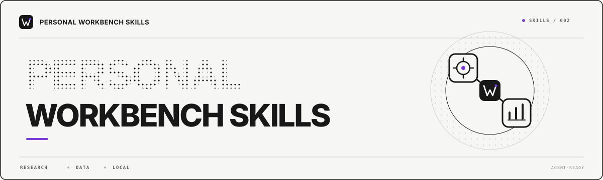

<p align="center">
  
</p>

# Personal Workbench Skills

Personal AI Workbench 的两个可独立安装 Agent Skills：

- `research-social-insights`：扫描近期中文 AI 社媒风向，或围绕指定主题研究国内中文平台的讨论、评论、回复、需求与反例。
- `douyin-account-data`：从用户本人已授权登录的抖音创作者中心获取账号数据，完成质量校验，并生成 Personal AI Workbench 抖音页面读取的数据文件。

## 交给 Agent 安装

把本仓库地址发给支持 Agent Skills 的工具，例如 Codex、Claude Code 或 WorkBuddy：

```text
https://github.com/oyorf/personal-workbench-skills
```

可以直接使用这条指令：

```text
请从这个仓库安装 research-social-insights 和 douyin-account-data，
阅读各自的 SKILL.md、运行要求和安全边界，并适配到你自己的 Skill 目录。
```

不同 Agent 的本地目录和调用方式可能不同，由 Agent 自己完成适配。本仓库只维护一份 Skill 真源，不分别维护多个工具的副本。

## 社媒洞察如何工作

`research-social-insights` 处理两类任务：扫描近期风向，或者围绕一个明确主题做深度研究。

### 社媒 Skill 使用示例

近期风向扫描：

```text
请使用 research-social-insights 扫描最近 7 天的中文 AI 社媒风向，
使用标准深度，整理大家正在做什么、主要争议、评论区需求和反例，
并把脱敏报告写入我的知识库。
```

指定主题深挖：

```text
请使用 research-social-insights 深挖“AI 编程工具”这个主题，
研究最近 30 天国内中文平台上的主要观点、使用场景、痛点、反方声音，
并分析一级评论和可见回复，把脱敏报告写入我的知识库。
```

它默认从以下中文信息源收集证据：

- 国内官方公告、监管文件、产品文档和公司发布，用来确认事实与时间；
- 国内科技新闻和中文专业网站，用来补充行业背景；
- 小红书、抖音、微博、知乎、哔哩哔哩等国内中文社媒；
- 帖子下的一级评论和可见回复，用来发现真实任务、痛点、反例和事实纠正。

平台能否实际覆盖，取决于当次主题、网络环境、用户授权和页面是否可以可靠读取；无法读取的来源必须明确标记为覆盖降级，不能假装已经采集。

上述国内中文公开网页使用当前 Agent 的网络搜索和网页打开能力。登录后才可见或必须交互的国内社媒页面，会通过用户已经授权的浏览器会话完成页面导航、DOM 读取、展开和点击。这部分操作的是实际网页界面，不调用平台官方开放 API，也不通过逆向接口、读取 Cookie 或绕过登录与反爬来获取数据。

采集完成后，Skill 会区分事实、用户观点、作者观点与 Agent 综合判断，去除重复转载，保留反方和小众声音，并默认排除昵称、头像、账号 ID、地区等非必要个人信息。最终只向目标知识库的 `10_raw/social-insights/` 写入脱敏 Markdown 报告，不自动生成选题，也不修改 Wiki。

详细流程见 [`research-social-insights/SKILL.md`](skills/research-social-insights/SKILL.md)。

## 抖音账号数据如何工作

`douyin-account-data` 只处理用户本人拥有或明确获权访问的抖音创作者中心。

采集时，Agent 在用户已授权的创作者中心页面中模拟正常操作：打开数据页面、切换周期和标签、点击平台提供的导出按钮，并下载官方 Excel。Excel 没有覆盖的少量字段，才会从当前页面的可见内容中补充。它不调用抖音开放 API，不逆向私有接口，也不抓取其他创作者账号。

完整数据链路是：

```text
本人已授权的创作者中心页面
→ 官方 Excel 与必要的页面证据
→ 临时目录解析
→ 缺失、重复与口径一致性检查
→ Workbench 数据契约
→ <私人 Vault>/30_self_media/douyin/current.json
```

只有全部质量门禁通过后，Skill 才会原子替换上一版有效数据。官方 Excel、页面快照和解析中间文件只保存在本轮系统临时目录，成功或失败后都会删除。

它不读取私信，不生成内容策略，不推荐下一条拍什么，也不会把真实作品 ID、账号标识或原始导出写进本仓库。详细字段、平台支持和失败回滚规则见 [`douyin-account-data/SKILL.md`](skills/douyin-account-data/SKILL.md)。

### 抖音 Skill 使用示例

```text
请使用 douyin-account-data 从我已授权并已登录的抖音创作者中心采集本人账号数据，
完成完整性和口径校验，并更新 Personal AI Workbench 使用的 current.json。
如果缺少 Workbench 或私人知识库路径，先询问我；遇到登录验证或平台风控时停止并让我处理。
```

## 浏览器与平台支持

### macOS：安装 Ego Lite

在 macOS 上，登录态社媒研究和抖音全自动采集默认使用 Ego Lite：

- [Ego Lite 官方网站](https://lite.ego.app/)
- [下载 Mac 版](https://lite.ego.app/zh-cn/download?auto=1)

安装后需要启动 Ego Lite 并完成首次引导，让它注册 `ego-browser` 和对应的 Agent Skill；然后在 Ego Lite 中登录本人有权访问的社媒页面或抖音创作者中心。若安装前已经打开 Codex、Claude Code 或其他 Agent，完成引导后可能需要重新打开 Agent，才能发现新安装的 Skill。

公开网页研究不强制依赖 Ego Lite；只有需要登录态、展开交互内容或执行抖音创作者中心自动导出时才需要它。Ego Lite 官网当前提供 Mac 下载，并提供 Windows 版本上线通知入口，实际平台支持以官网为准。Windows 上的抖音采集不等待 Ego Lite Windows 版，可以直接使用本仓库内置的 Playwright 适配器。

### 平台能力对照

| 使用场景 | macOS | Windows |
|---|---|---|
| 运行 Workbench 和 synthetic demo | 支持 | 支持 |
| 研究中文公开网页 | 使用 Agent 自带能力 | 使用 Agent 自带能力 |
| 读取登录后可见的社媒页面 | Ego Lite | 取决于用户所用 Agent 的浏览器能力，本仓库未内置通用适配器 |
| 抖音创作者中心全自动采集 | Ego Lite 适配器 | 已内置 Playwright 适配器，可使用 Chromium、Chrome 或 Edge |
| 抖音数据处理与发布 | 官方 Excel → 质量门禁 → 原子发布 | 与 macOS 共用同一套解析、质量门禁和原子发布流程 |

### 模型多模态要求

浏览器能够打开页面，不代表当前模型能够理解页面截图。如果接入的是仅支持文本的模型，例如仅文本版本的 DeepSeek，而不是支持图片输入的多模态模型，那么所有依赖截图识别、图片内容理解、Canvas 画面判断或纯视觉定位的功能都无法使用。

对本仓库两个 Skill 的影响如下：

- `research-social-insights` 优先读取网页正文和 DOM；当页面只能通过截图查看、需要从图片中识别内容，或必须依靠视觉判断才能展开和定位控件时，仅文本模型无法完成这部分采集。应换用支持图片输入的多模态模型，或者放弃该来源并在报告中标记覆盖降级。
- `douyin-account-data` 的主要数据来自官方 Excel，代码中的“页面快照”主要是把页面可见文本保存为临时 JSON，并不等同于图片截图。因此，只要 Agent 的浏览器工具可以提供 DOM 和按钮操作，核心采集不强制要求模型看图；但如果所用 Agent 只能把浏览器页面以截图形式交给模型，那么仅文本模型无法完成全自动采集，应改用多模态模型或手动下载官方 Excel。
- 二维码、验证码、账号确认和平台风控始终由用户本人在浏览器中处理。无论模型是否支持多模态，Skill 都不会识别验证码、读取二维码内容或绕过验证。

选择模型时，需要同时确认“模型支持图片输入”和“当前 Agent 工具允许把浏览器截图传给模型”。只有模型和工具链两侧都支持，多模态页面操作才可用。

Linux 可以运行 Workbench、synthetic demo 和公开网页研究。抖音适配器使用跨平台 Playwright API，但本仓库尚未验证 Linux 下的完整创作者中心流程；需要真实数据时应先采用官方 Excel 手动导出方案。

### Windows 上的 Playwright 方案

[Playwright](https://playwright.dev/) 支持 Windows，并可控制 Chromium、Chrome 或 Edge。本仓库已为 `douyin-account-data` 内置 Playwright 采集器：首次运行打开可见浏览器让用户扫码，后续复用专用的本地登录目录；浏览器采集完成后，继续使用原有的数据解析、质量校验和发布流程。

在 Windows PowerShell 中，从本仓库根目录运行：

```powershell
py -3 -m venv .venv
.\.venv\Scripts\python.exe -m pip install -r skills\douyin-account-data\requirements-windows.txt
.\.venv\Scripts\python.exe -m playwright install chromium
.\.venv\Scripts\python.exe skills\douyin-account-data\scripts\collect_playwright.py --check
```

检查通过后执行采集：

```powershell
.\.venv\Scripts\python.exe skills\douyin-account-data\scripts\collect_playwright.py `
  --dashboard-root "<Personal AI Workbench 根目录>" `
  --vault-root "<私人知识库根目录>"
```

首次运行时，在打开的 Chromium 窗口中完成扫码或账号确认即可。默认登录目录位于当前 Windows 用户的本地应用数据目录，不会放进仓库、Workbench 或私人知识库。也可以加 `--browser-channel msedge` 使用本机 Edge。

采集器只操作创作者中心真实页面和平台提供的官方导出按钮，不逆向私有接口，也不拦截接口响应。Excel 和必要页面证据只进入本轮系统临时目录；遇到验证码、权限确认或风控会停止并交还用户，任何失败都不会覆盖上一版有效数据。

Playwright 官方说明，登录状态文件可能包含可冒用账号的 Cookie 与请求头，不能提交到仓库；新版 Chrome 也不支持直接自动化日常使用的默认用户配置目录。因此 Windows 适配器应使用专门的自动化配置目录。参见 [Authentication](https://playwright.dev/docs/auth) 和 [`launchPersistentContext`](https://playwright.dev/docs/api/class-browsertype#browser-type-launch-persistent-context)。

完整安装、浏览器选择和隐私模型见 [`platform-support.md`](skills/douyin-account-data/references/platform-support.md)。无论使用哪种浏览器方案，Skill 都不能读取、打印、复制或导出密码、Cookie、登录令牌和会话参数。

## 平台规则与使用风险

本仓库用于学习、研究和本地自动化实践，不代表任何平台授权，也不保证自动化交互不会触发扫码登录、验证码、账号确认、限流或其他风控。

使用者需要确认自己拥有相关页面和账号的访问权限，并自行遵守平台服务条款与适用法律。遇到登录验证、权限门禁、反爬提示或速率限制时，Skill 必须停止当前来源并交还用户处理，不提供绕过方案。

因无授权访问、违反平台规则或不当自动化造成的账号限制及其他损失，由使用者自行承担。维护者只提供学习方案和数据处理示例，不承诺规避平台风控。

## 隐私边界

- 只访问用户主动授权且本人有权访问的账号或页面。
- 不读取、打印、复制或提交密码、Cookie 和会话参数；Windows 登录态只由浏览器保存在专用本地目录，Skill 不检查、导出或提交该目录。
- 官方导出、页面快照和中间解析文件只保存在系统临时目录。
- 数据质量失败时不覆盖上一版有效 `current.json`。
- 测试数据必须从零合成，不能由真实账号数据轻微改写。
- 登录态、浏览记录和真实账号数据禁止提交到 Git。

## 验证

```bash
python3 /path/to/skill-creator/scripts/quick_validate.py skills/research-social-insights
python3 /path/to/skill-creator/scripts/quick_validate.py skills/douyin-account-data
python3 -m unittest skills/douyin-account-data/scripts/test_analyze_snapshot.py
python3 -m unittest skills/douyin-account-data/scripts/test_collect_playwright.py
python3 skills/research-social-insights/scripts/validate_report.py --help
node scripts/privacy-scan.mjs
```

## License

MIT。见 [LICENSE](LICENSE)。
